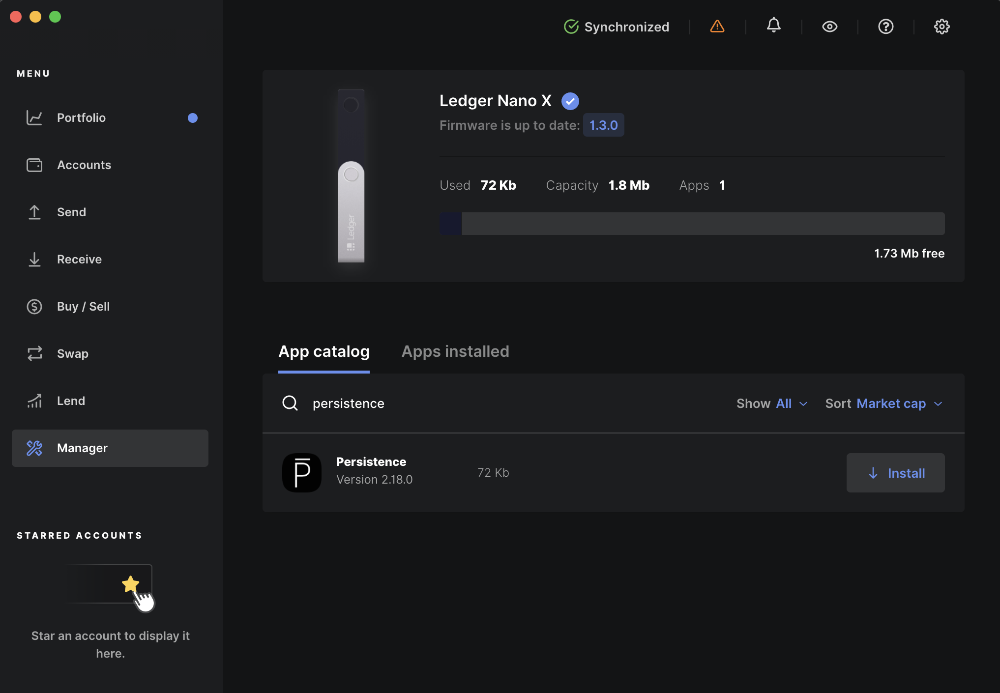
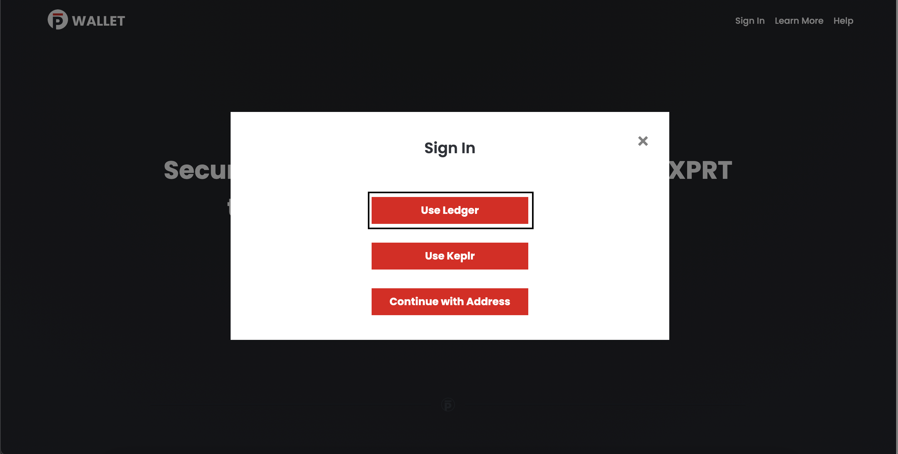
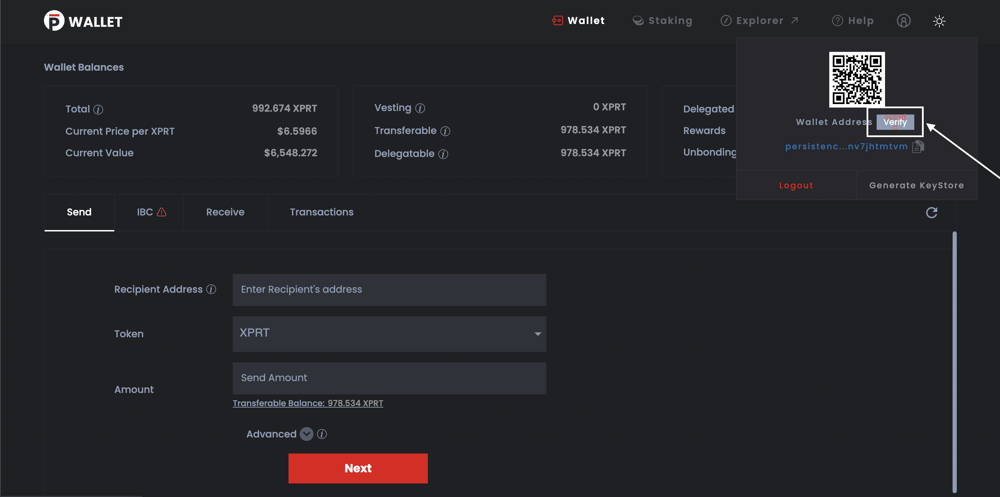

# Ledger Nano Support

Using a hardware wallet to store your private keys comes in handy and improves the security of your crypto assets.
The **Ledger** device acts as an enclave of the seed phrase (mnemonic) and private keys and thereby the process of
signing transaction takes place within it. Your private information is secure and will not leak from the Ledger device.
Here is a short tutorial on using the **Elysium Ledger** app with the **ElysiumCore CLI**.

At the core of a **Ledger** device there is a mnemonic (seed phrase) that is used to generate private keys. The seed
phrase is generated when you initialize your **Ledger**. The mnemonic is compatible with **Elysium** and can be used
to seed new accounts.

::: **Danger**
Do _not_ lose or share your 24 words seed phrase with anyone. To prevent theft or loss of funds, we recommend you to
keep multiple copies of your mnemonic stored in safe and secure locations. Please be aware that if someone gains access
to your mnemonic, they can fully control your associated accounts.
:::

## Install the Elysium Ledger application

Installing the **Elysium** application on your ledger device is required before you
use [`elysiumCore`](#elysiumcore-cli-+-ledger-nano). To do so, you need to:

1. Install [Ledger Live](https://shop.ledger.com/pages/ledger-live) on your machine.
2. Using Ledger
   Live, [update your Ledger Device with the latest firmware](https://support.ledger.com/hc/en-us/articles/360002731113-Update-device-firmware)
   . On the Ledger Live application, navigate to the **Menu** and then the **Manager** menu item.
   
4. Connect your **Ledger Nano** device and select the **Allow Ledger Manager on your device** check box.
5. On the **Ledger Live** application, search for **Elysium**.
6. Install the **Elysium** application by clicking **Install**.
   

## Elysium Wallet + Ledger Nano

You can sign into your **Elysium Wallet** and do all transactions using the **Ledger Nano** device without having
the need to use your private key or mnemonic.

**Prerequisites**: [Install the Elysium app](#install-the-elysium-ledger-application) on your Ledger Nano before
doing the following task.

1. After connecting your Ledger device to the computer, unlock it with the **PIN** and open the **Elysium Wallet**
   app on your Ledger device.
2. Open the [Elysium Wallet](https://wallet.elysium.one/) in your web browser.
3. Select **Sign in** on the web wallet.
   
4. You can now start using **Elysium Wallet** with your Ledger Nano.

**Note**: When you transact on Elysium Wallet (**Send** or **Stake**), you need to confirm the transaction on your
Ledger device. An indication is displayed on your Elysium Wallet app to approve or reject the transaction.

### Confirm address on ledger

After you're signed in, you can verify your wallet address with the address on the Ledger device by using the **Verify**
button.   


## ElysiumCore CLI + Ledger Nano

**Note: You need to [install the Elysium app](#install-the-elysium-ledger-application) on your Ledger Nano
before performing this task**.

The tool used to generate addresses and transactions on the Elysium is **elysiumCore**. Here is how to get
started.

### Before you begin

- [Install Golang](https://golang.org/doc/install)
- [Install ElysiumCore](https://github.com/merlin-network/elysiumCore#installation-steps)

Verify that **elysiumCore** is installed correctly with the following command:

```bash
elysiumCore version --long

➜ name: elysiumCore
server_name: elysiumCore
version: 0.1.3-2-gebc7dc7
commit: ebc7dc7
build_tags: netgo,ledger
go version go1.14.5 darwin/amd64
```

### Add your Ledger key

1. Connect and unlock your **Ledger** device.
2. Open the Elysium app on your Ledger device.
3. Create an account in elysiumCore from your ledger key.

::: **Tip**
Change the _keyName_ parameter to a meaningful name so that you can identify it with ease. The **Ledger** flag
indicates **elysiumCore** to use your Ledger to seed the account.
:::

```bash
elysiumCore keys add <keyName> --ledger

➜ NAME: TYPE: ADDRESS:     PUBKEY:
<keyName> ledger did:fury:e1... elysiumpub1...
```

Elysium uses HD wallets. This means you can setup multiple accounts using the same Ledger seed. To create another
account from your Ledger device, run (change the integer i to some value >= 0 to choose the account for HD derivation):

```bash
elysiumCore keys add <secondKeyName> --ledger --account <i>
```

### Confirm your address

Run this command to display your address on the device. Use the **keyName** that you entered on your ledger key. The -d
flag is supported in version 1.2.0 and higher.

```bash
elysiumCore keys show <keyName> -d
```

Confirm that the address displayed on the device matches the one that's displayed when you added the key.

### Connect to a full node

Next, you need to configure **elysiumCore** with the URL of a Elysium full node and the appropriate **chain_id**
. In this example, we connect to the public load balanced full node operated by Elysium on the **core-1** chain. You
can point your **elysiumCore** to any Elysium full node. Be sure that the **chain-id** is set to the same chain
as the full node.

Test your connection with a query such as:

``` bash
elysiumCore query staking validators --node https://rpc.core.elysium.one:443 --chain-id core-1
```

::: **Tip**
To run your own full node
locally [read more here.](https://github.com/merlin-network/elysiumCore#initialize-a-new-chain-and-start-node).
:::

### Send a transaction

You are now ready to start signing in and sending transactions. Send a transaction with elysiumCore using the the **
tx send** command.

``` bash
elysiumCore tx bank send --help # to see all available options.
```

::: **Tip**
Ensure that you unlock your device with the **PIN** and then open the **Elysium** app before trying to run these
commands
:::

Use the **keyName** you set for your Ledger key and elysiumCore will connect with the Elysium Ledger app to then
to sign your transaction.

```bash
elysiumCore tx bank send <keyName> <destinationAddress> <amount><denomination> --node https://rpc.core.elysium.one:443 --chain-id core-1
```

When you are shown the message, **Confirm transaction before signing**, select Answer **Y**.

When you are prompted to review and approve the transaction on your Ledger device, make sure to inspect the transaction
JSON displayed on the screen. You can scroll through each field and each message. Scroll down to read more about the
data fields of a standard transaction object.

Now, you are all set to start sending transactions on the network.

### Receive funds

To receive funds to the Elysium Wallet account on your Ledger device, retrieve the address to your Ledger account (
the ones with `TYPE ledger`) with this command:

```bash
elysiumCore keys list

➜ NAME:   TYPE:  ADDRESS:        PUBKEY:
<keyName> ledger did:fury:e1... elysiumpub1...
```

### Further documentation

If you aren't sure what **elysiumCore** can do, just run the command without arguments to output documentation for
the commands it supports.

::: **Tip**
The **elysiumCore** help commands are nested. So `$ elysiumCore` will output docs for the top level commands (
status, config, query, and tx). You can access documentation for sub commands with further help commands.

For example, to print the **query** commands:

```bash
elysiumCore query --help
```

Or to print the **tx** (transaction) commands:

```bash
elysiumCore tx --help
```

:::

## The Cosmos standard transaction

Transactions in Elysium embed
the [Standard Transaction type](https://godoc.org/github.com/cosmos/cosmos-sdk/x/auth#StdTx) from the Cosmos SDK. The
Ledger device displays a serialized JSON representation of this object for you to review before signing the transaction.
Here are the fields and what they mean:

- **chain-id**: The chain to which you are broadcasting the tx, such as the **test-core-1** testnet or **core-1**:
  mainnet.
- **account_number**: The global ID of the sending account assigned when the account receives funds for the first time.
- **sequence**: The nonce for this account, incremented with each transaction.
- **fee**: JSON object describing the transaction fee, its gas amount and coin denomination
- **memo**: optional text field used in various ways to tag transactions.
- **msgs_<index>/<field>**: The array of messages included in the transaction. Double click to drill down into the
  nested fields of the JSON.

## Support

For any questions or support, do reach us out on our [Telegram channel](https://t.me/ElysiumOneChat).
